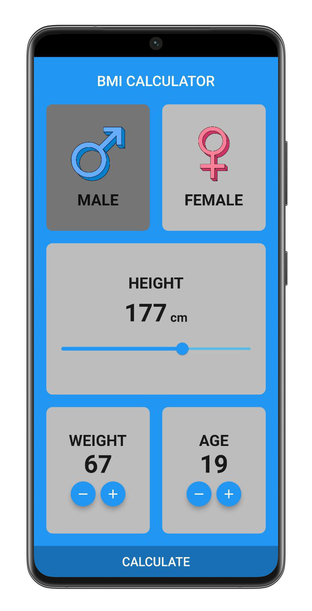
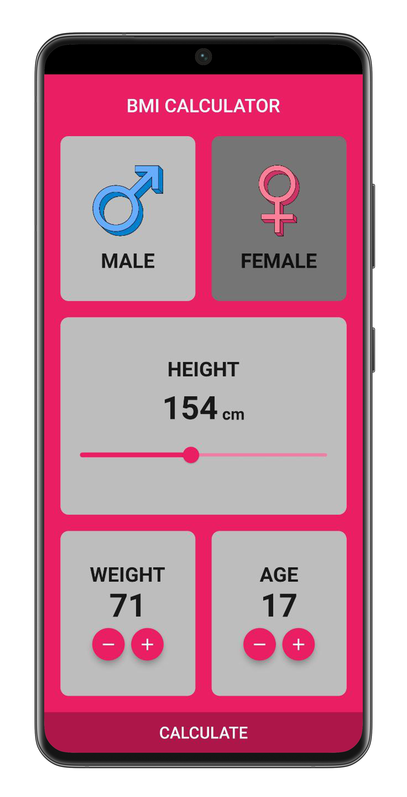
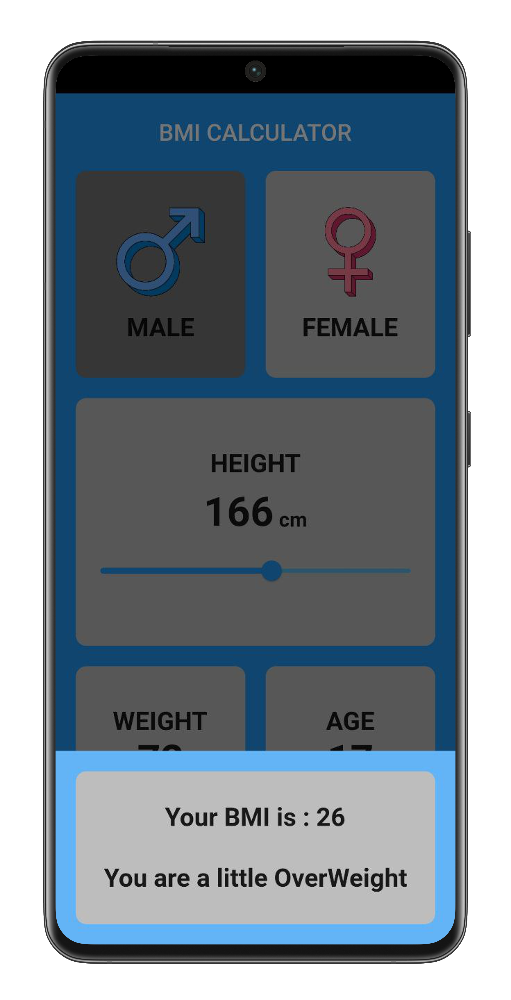

# 🧮 BMI Calculator

A simple and modern Body Mass Index (BMI) Calculator app built with Flutter.  
This app allows users to input their height and weight to calculate their BMI and view the corresponding health category.

## 📱 Features

- Input height and weight easily
- Instant BMI calculation
- Visual feedback with result interpretation
- Clean and responsive UI

## 🚀 Technologies Used

- Flutter
- Dart
- Material Design

## 📷 Screenshots
 
| Male Selection | Female Selection | Result |
|-------------|------------|----------------------|
|  |  |  |

## 🛠 Getting Started

1. Clone the repo:
```bash
git clone https://github.com/YOUR_USERNAME/bmi_calculator.git
